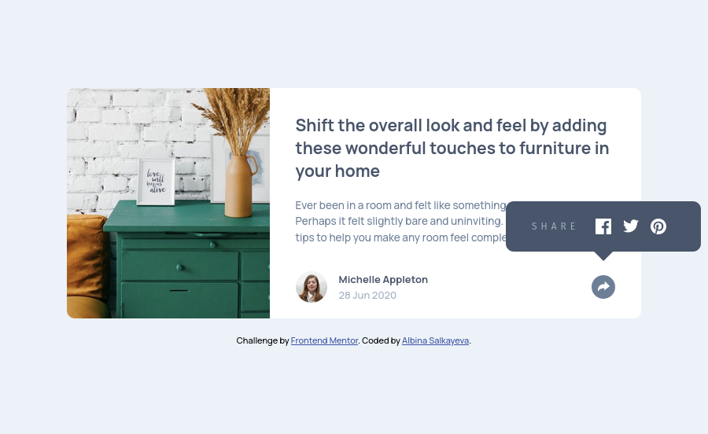
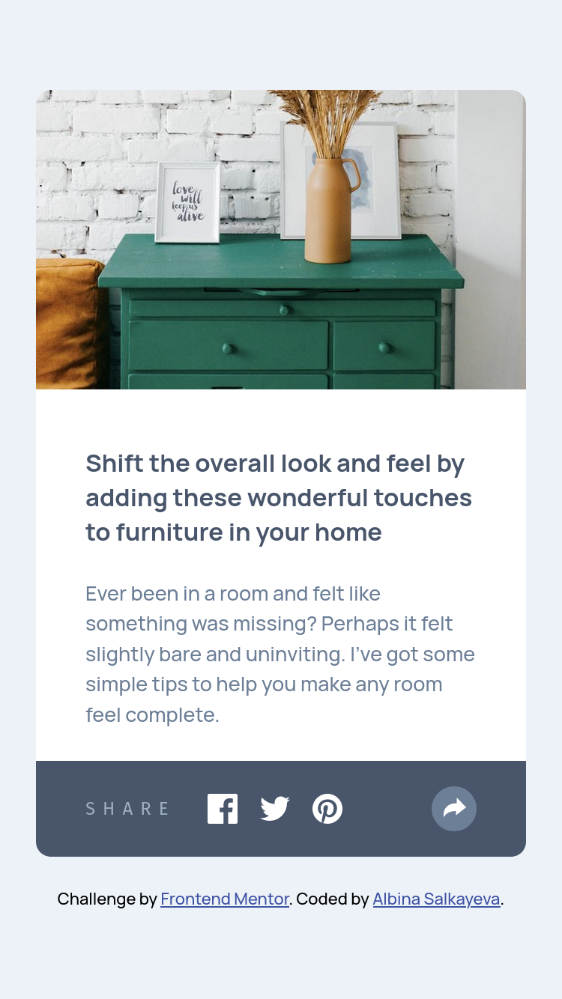

# Frontend Mentor - Article preview component solution

This is a solution to the [Article preview component challenge on Frontend Mentor](https://www.frontendmentor.io/challenges/article-preview-component-dYBN_pYFT). Frontend Mentor challenges help you improve your coding skills by building realistic projects. 

## Table of contents

- [Overview](#overview)
  - [The challenge](#the-challenge)
  - [Screenshots](#screenshots)
  - [Links](#links)
- [My process](#my-process)
  - [Built with](#built-with)
  - [What I learned / Useful resources](#what-i-learned--useful-resources)
- [Author](#author)

## Overview

### The challenge

Users should be able to:

- View the optimal layout for the component depending on their device's screen size
- See the social media share links when they click the share icon

### Screenshots

| Desktop                            | Mobile                             |
| ---------------------------------- | ---------------------------------- |
|  |  |

### Links

- Solution URL: [https://github.com/albina0104/article-preview-component](https://github.com/albina0104/article-preview-component)
- Live Site URL: [https://albina0104.github.io/article-preview-component/](https://albina0104.github.io/article-preview-component/)
 
## My process

### Built with

- Semantic HTML5 markup
- Sass
- Flexbox & Grid
- JavaScript
- Mobile-first workflow

### What I learned / Useful resources

- The code of SVG images can be pasted directly into HTML (in this case we can also remove `xmlns`, `width`, `height` attributes from the `<svg>` tag). This way we can change the path's `fill` attribute using CSS to change the color of the images.

  ```html
  <svg xmlns="http://www.w3.org/2000/svg" width="20" height="20">
    <path fill="#FFF" d="M18.896 0H1.104C.494 0 0 .494 0 1.104v17.793C0 19.506.494 20 1.104 20h9.58v-7.745H8.076V9.237h2.606V7.01c0-2.583 1.578-3.99 3.883-3.99 1.104 0 2.052.082 2.329.119v2.7h-1.598c-1.254 0-1.496.597-1.496 1.47v1.928h2.989l-.39 3.018h-2.6V20h5.098c.608 0 1.102-.494 1.102-1.104V1.104C20 .494 19.506 0 18.896 0z"/>
  </svg>
  ```

  The downside of this method is that we cannot make the image bigger by changing width and height in CSS (we change the size only of the svg container, but the image itself stays the same). Because of that, I could not use this solution. I made 2 versions of each .svg file, and changed the `fill` attribute inside the .svg files to change the color, for the purpose of changing it on hover.

  Related article: [Change Color of SVG on Hover (css-tricks.com)](https://css-tricks.com/change-color-of-svg-on-hover/).

- When I set `width: 39%;` for an image, it took 39% of the parent element's width on Google Chrome, but on Firefox the image itself became 39% of its initial size. It looks like Firefox and Chrome calculate % value by different elements (Firefox on img, Chrome on parent). The issue fix that worked is in my commit: [Fix image display on Firefox](https://github.com/albina0104/article-preview-component/commit/70fe7eeb1304d26852970cfa8d62df0fb7f639e0).

- `overflow: hidden;` hides even absolute positioned child elements, so I cannot use it to round corners of the child images if the card has rounded corners.

- To position the share panel relatively to the share button on desktop, I needed to make the panel the child of the button. The article which helped to make the panel for desktop: [CSS Tooltip (W3Schools)](https://www.w3schools.com/css/css_tooltip.asp).

- On mobile, the share panel (child element of the share button) needs to be behind the button. And if I make the button image as a background, or a background behind the image, the background will be hidden behind the child share panel, the `z-index` property will not help. So I had to use an SVG editor to add a circle behind the arrow, and added the image to the HTML. This way `z-index` works.

  The editor I used: [SVGEdit](https://svgedit.netlify.app/editor/index.html) (source code on GitHub is [here](https://github.com/SVG-Edit/svgedit)).

- We can adjust which part of the image will be displayed: [CSS The object-position Property (W3Schools)](https://www.w3schools.com/css/css3_object-position.asp)

  ```css
  object-position: left;
  ```

- Check if an element contains a class in JavaScript:

  ```js
  if (sharePanel.classList.contains('flex')) {...}
  ```

- How to set an attribute value in JavaScript:

  ```js
  shareBtnImg.setAttribute('src', './images/icon-share-1.svg');
  ```

## Author

- Frontend Mentor - [@albina0104](https://www.frontendmentor.io/profile/albina0104)
- GitHub - [albina0104](https://github.com/albina0104)
